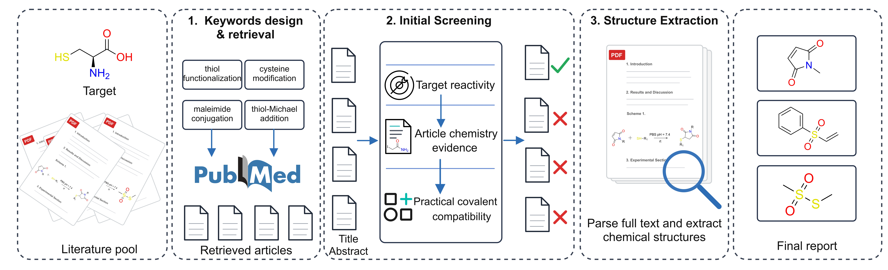

# pClaw

pClaw packages the `covalent-probe-discovery` skill for Claw / OpenClaw /
AutoClaw. It surveys chemistry literature and identifies covalent reactive
handles ("warheads") for a target amino-acid residue or side-chain
functionality.

The repository is meant to be installed into an agent skills directory. The
agent reads [SKILL.md](SKILL.md), uses the prompt files under
[references/](references/), and calls the deterministic Python CLIs under
[scripts/](scripts/) for PubMed search, open-access PDF retrieval, SMILES
validation, structure rendering, and ranking.

Naming note: `pClaw` is the repository name. The skill registered in
[SKILL.md](SKILL.md) is named `covalent-probe-discovery`, so that is the name
to use when asking an agent to run it.



## Install as a Claw skill

For OpenClaw / AutoClaw:

```bash
mkdir -p ~/.openclaw-autoclaw/skills
git clone https://github.com/mr-johnee/pClaw.git ~/.openclaw-autoclaw/skills/pClaw
cd ~/.openclaw-autoclaw/skills/pClaw
```

If you copy the folder manually, make sure the installed folder contains
[SKILL.md](SKILL.md) at its root, together with `scripts/`, `references/`, and
`data/`.

Install the Python dependencies:

```bash
python3 -m pip install -r requirements.txt
```

If `rdkit` is difficult to install with pip on your platform, use conda:

```bash
conda create -n covalent-probe python=3.12 -c conda-forge rdkit httpx jsonschema
conda activate covalent-probe
```

## Configure

The Unpaywall open-access lookup requires a contact email:

```bash
export CHEM_PDF_UNPAYWALL_EMAIL="you@example.com"
```

Keep real local values in your shell profile or a private `.env` file. Do not
commit real emails, API keys, or tokens. [env.example.sh](env.example.sh) is a
public template that documents the available variables.

## Use

Restart Claw / OpenClaw / AutoClaw after installing the skill, then ask in
plain language:

> "Use covalent-probe-discovery to survey novel cysteine-reactive warheads
> from chemistry literature published between 2015 and 2025."

You can optionally specify a publication-year window and journal whitelist.
The skill records those choices in the generated run artifacts.

The main output is `report.md`. The run directory may also contain
`keywords.txt`, `pubmed_results.json`, `shortlist.json`, `pdfs/`,
`candidates.json`, `candidates.enriched.json`, validation logs, and rendered
structure images.

## License

MIT. See [LICENSE](LICENSE).
